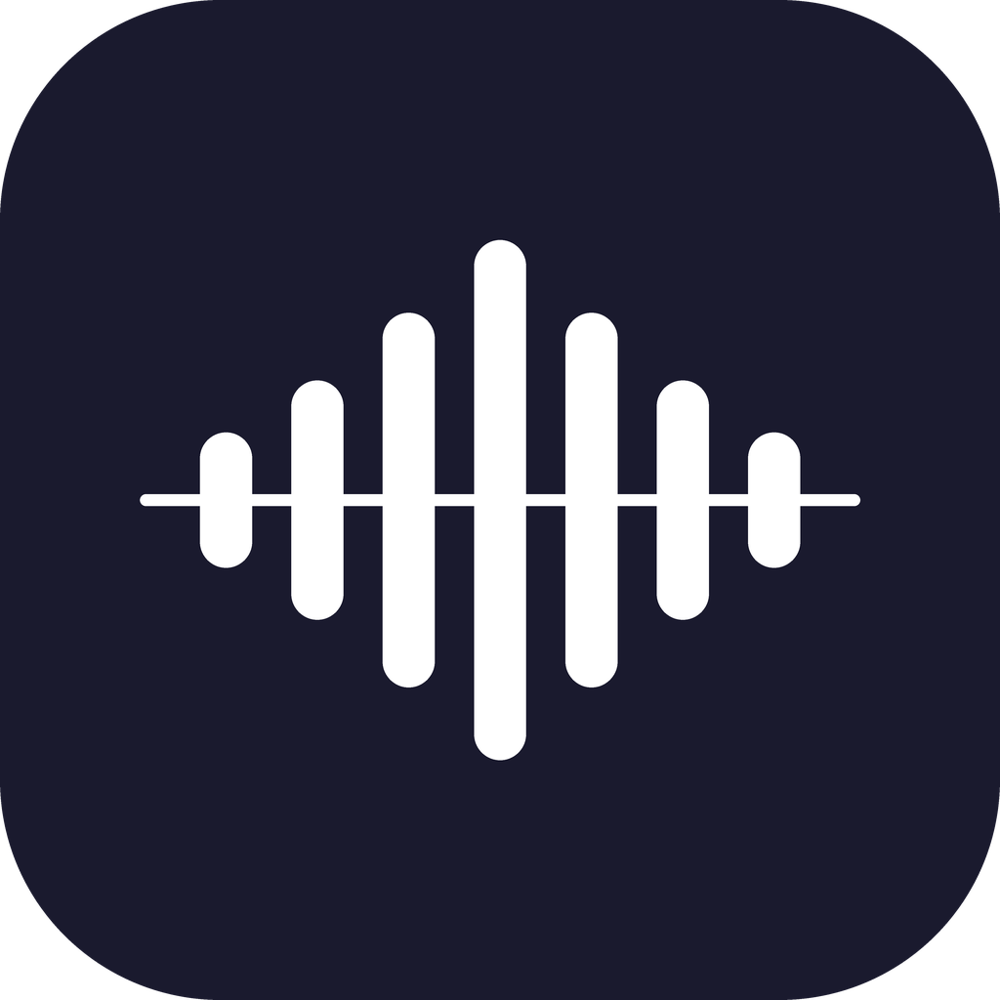
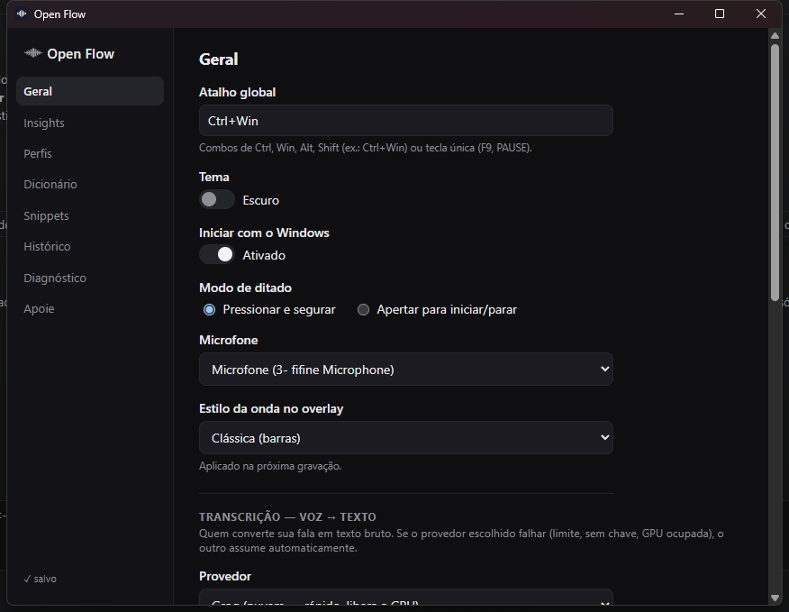
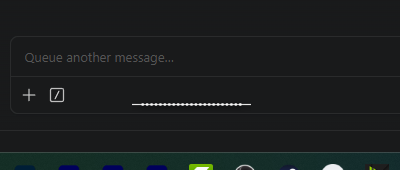

<p align="center"></p>
<h1 align="center">Open Flow</h1>
<p align="center"><b>Segure uma tecla, fale, solte — o texto sai pronto onde o cursor estiver.</b><br>
Ditado inteligente para Windows e macOS: transcrição + limpeza + formatação por perfil, em ~2s e R$ 0/mês.</p>
<p align="center">
  <a href="../../releases"></a>
  
</p>

Segure **Ctrl+Win** (Windows) ou **Ctrl+Option** (Mac), fale, solte. O que você disse é transcrito, limpo (sem hesitações e
autocorreções da fala) e formatado no estilo do perfil ativo — e-mail, jurídico, WhatsApp,
roteiro — direto no campo onde o cursor estiver.

Exemplo real do comportamento: ditar *"Certifico que fui até o endereço, é, não, melhor,
dirigi-me ao endereço indicado no mandado... deixa eu corrigir, o imóvel pertence ao pai da
parte..."* produz *"Certifico que me dirigi ao endereço indicado no mandado. No local, fui
informado de que o imóvel pertence ao genitor da parte..."*.

<p align="center"></p>
<p align="center"><br>
<i>Enquanto você fala, uma onda discreta aparece na parte inferior da tela.</i></p>

## Instalação (usuários)

Não precisa saber programar. Você vai precisar de duas chaves gratuitas (5 minutos, sem cartão
de crédito) e do instalador.

**1. Baixe e instale**

*Windows:*

- Vá em [Releases](../../releases/latest) e baixe o `OpenFlow_x.y.z_x64-setup.exe` mais recente
- Execute. O Windows SmartScreen vai avisar que o app não é reconhecido (ele não tem assinatura
  digital paga): clique em **"Mais informações" → "Executar assim mesmo"**. O código-fonte
  completo está neste repositório para quem quiser auditar.
- Ao final, o Open Flow aparece como um ícone na bandeja do sistema (perto do relógio)

*macOS (Apple Silicon):*

- Vá em [Releases](../../releases) e baixe o `OpenFlow_x.y.z_aarch64.dmg` mais recente (as v0.1.8
  e v0.1.9 corrigem bugs só do Windows e não têm build do Mac; da v0.1.10 em diante o DMG voltou).
  A v0.1.13 é o inverso: corrige o press-and-hold do Mac e refina o prompt, e saiu só com DMG —
  no Windows, o instalador mais recente segue sendo o da v0.1.11
- Abra o DMG e arraste o Open Flow para **Aplicativos**
- Na primeira abertura, o Gatekeeper vai bloquear (app sem assinatura paga da Apple): vá em
  **Ajustes → Privacidade e Segurança** e clique em **"Abrir Assim Mesmo"**
- Conceda as permissões que o app pedir: **Acessibilidade** e **Monitoramento de Entrada**
  (para o atalho global) e **Microfone**. Se alguma não aparecer, adicione o Open Flow
  manualmente em Ajustes → Privacidade e Segurança
- O app fica como um ícone na barra de menus (sem ícone no Dock)

**2. Crie as duas chaves gratuitas**

| Chave | Onde criar | Para quê |
|---|---|---|
| Groq | [console.groq.com/keys](https://console.groq.com/keys) → "Create API Key" | Transcrever sua voz (~2.000 ditados grátis/dia) |
| Gemini | [aistudio.google.com/apikey](https://aistudio.google.com/apikey) → "Create API key" | Limpar e formatar o texto (free tier) |

Ambas usam login Google e não pedem cartão.

**3. Configure (uma vez)**

- Clique no ícone do Open Flow na bandeja → abre a janela de configurações
- Na aba **Geral**, cole a chave Groq no campo "Chave da API Groq" e a chave Gemini no campo
  "Chave da API Gemini" (o ícone de olho revela o que você colou)
- Escolha seu microfone, se não quiser o padrão do sistema

**4. Use**

Clique em qualquer campo de texto (e-mail, WhatsApp Web, Word...), **segure Ctrl+Win (Windows)
ou Ctrl+Option (Mac), fale, e solte**. Uma onda discreta aparece no rodapé da tela enquanto você fala; ~2 segundos depois de
soltar, o texto limpo aparece onde o cursor estava. Na aba **Perfis** você escolhe o estilo do
texto (natural, e-mail, jurídico formal, WhatsApp curto, roteiro).

Notas:
- **Privacidade**: o áudio vai para a Groq e o texto para o Google (free tiers podem usar dados
  para treino). Para transcrição 100% local/offline, veja "Modo local" abaixo — exige GPU NVIDIA
  e Python.
- O app se registra para **iniciar com o sistema** automaticamente na primeira execução
  (dá para desligar em Configurações → Geral).
- Sem a chave Gemini o texto sai bruto (sem limpeza); sem a chave Groq (e sem modo local) o
  ditado não funciona.

### Modo local (opcional, para quem tem GPU NVIDIA)

A transcrição pode rodar 100% na sua máquina (o áudio nunca sai do PC), como fallback automático
ou como provedor principal:

```powershell
git clone https://github.com/mackswendhell/open-flow
cd open-flow
python -m venv .venv
.venv\Scripts\pip install faster-whisper nvidia-cublas-cu12 nvidia-cudnn-cu12
```

Depois ajuste `python` e `sidecar` no `%APPDATA%\OpenFlow\settings.json` para os caminhos do seu
clone, e escolha o provedor "Local" nas configurações. Na primeira execução o modelo (~1,6GB) é
baixado automaticamente.

## Arquitetura

```
[Hook de teclado global (Rust: WH_KEYBOARD_LL no Windows / CGEventTap no Mac)]
        segura Ctrl+Win (Win) ou Ctrl+Option (Mac) ──> [cpal grava WAV do microfone]
        solta ↓
[Transcrição (STT)]  Groq whisper-large-v3-turbo (nuvem, padrão)
                     ⇅ fallback automático bidirecional
                     faster-whisper large-v3-turbo local (GPU, sidecar Python residente)
        texto bruto ↓
[Reescrita]  Gemini Flash Lite (free tier, com fallback de modelo) + regras de edição
             + dicionário + perfil de escrita ativo
        texto final ↓
[Inserção]  clipboard + Ctrl+V/Cmd+V sintético (com backup/restauração do clipboard)
```

Durante a gravação o overlay mostra as ondas; ao soltar o atalho ele passa a três pontos
("processando") e só some quando o texto entra. Se algo falhar no caminho, o motivo aparece
ali mesmo em vez de sumir no console. `Esc` durante a gravação descarta o ditado.

- **App**: Tauri 2 (Rust) + React/TypeScript — bandeja do sistema, overlay de ondas reativas
  ao microfone (2 estilos), janela de configurações com abas (Geral, Insights, Perfis,
  Dicionário, Snippets, Histórico, Diagnóstico), temas claro/escuro.
- **Sidecar STT local**: `sidecar/stt_server.py` — servidor HTTP local com faster-whisper na
  GPU; morre junto com o app (vigia o PID pai) e recusa porta duplicada.
- **Dados**: tudo local em `%APPDATA%\OpenFlow\` (Windows) ou
  `~/Library/Application Support/OpenFlow/` (Mac) — settings.json com as chaves, history.jsonl.
  Histórico é desligável e apagável pela UI. No Windows as chaves são cifradas por usuário
  (DPAPI, prefixo `enc:`); no Mac ficam em texto, protegidas pelas permissões do perfil.
- **Plataformas**: mesmo código, com a camada específica isolada em
  `app/src-tauri/src/platform/{windows,macos}.rs` (hook de teclado, proteção de chaves,
  atalho de colar, sidecar).

## Decisões de arquitetura e porquês

| Decisão | Por quê |
|---|---|
| STT híbrido nuvem+local (Groq padrão, local fallback) | Groq free tier (~2.000/dia) libera a GPU e dá boot instantâneo; o local garante offline e privacidade total quando escolhido. Fallback automático nos dois sentidos. |
| Reescrita no Gemini Flash Lite free tier | Menor latência (~1,4s medidos no `gemini-3.5-flash-lite`) e custo zero via API oficial. Sem chave, o app degrada para texto bruto corrigido pelo próprio Whisper. A classe *lite* é deliberada: editar transcrição é trabalho leve, e modelo maior custa espera e tende a reescrever mais do que se pede. |
| Não usar conta ChatGPT Plus como "API" | Não existe ponte legítima Plus→API; automação do ChatGPT web viola ToS e quebra fácil. Caminhos oficiais mapeados (Codex CLI, Claude CLI) ficam como providers futuros. |
| Tauri 2 em vez de Electron | Tray + overlay com ~11MB de exe e pouca RAM residente; UI em React/TS (stack já dominada). |
| Hook de teclado de baixo nível próprio (WH_KEYBOARD_LL / CGEventTap) | Único jeito de detectar press-and-hold global (a API de hotkey comum não emite "soltou"). Suporta combos de modificadores e modo toggle. O rdev foi removido: chamava ToUnicode dentro do hook e consumia as dead keys (~/^) do teclado ABNT2. |
| Inserção via clipboard+Ctrl+V/Cmd+V com restauração | Método mais compatível; fallback natural: o texto fica no clipboard se o app alvo bloquear paste (ex.: janelas elevadas/UIPI). |
| Port macOS no mesmo repositório (`platform/` + `#[cfg]`) | Uma base de código, sem fork. Equivalências: WH_KEYBOARD_LL→CGEventTap listen-only, Ctrl+V→Cmd+V com keycode cru. Atalho padrão do Mac é Ctrl+Option (Ctrl+Cmd foi descartado: Ctrl+Cmd+Q bloqueia a tela). |
| Sem Keychain no macOS (chaves em texto no settings.json) | A autorização de leitura de uma entrada do Keychain é amarrada ao hash do binário: todo rebuild assinado pedia a senha do keychain `login`, e quando essa senha diverge da senha da conta o app fica trancado fora das próprias chaves. São chaves de API free tier num app local — o Windows segue no DPAPI, que é transparente. |
| Cancelar ditado no `Esc`, não no Espaço | O hook é listen-only por decisão de projeto, então o sistema recebe a combinação junto: com o atalho segurado, `Ctrl+Option+Espaço` (Mac) e `Win+Espaço` (Windows) trocam a fonte de entrada e mudam o layout do teclado no meio do ditado. |
| Prompt de reescrita em duas camadas (invioláveis + padrão conservador + perfil) | Chamar tudo de "inviolável" engessava o texto: as regras vinham antes do estilo e nenhum perfil conseguia afrouxá-las, então repetição intencional virava erro e a fala voltava mais formal do que saiu. Hoje só três coisas são absolutas (não inventar, não resumir, não omitir); a edição é conservadora por padrão — preserva palavras, trata repetição como ênfase, descarta apenas retratação explícita — e o `Estilo:` do perfil, que vem por último, pode pedir mais liberdade (o de e-mail reescreve e quebra em linhas). |
| Estrutura decidida pela fala, não pelo perfil | Ditar uma resposta e receber um bloco único é ruim, mas obrigar tópicos é pior. A regra pede parágrafos quando o assunto muda e numeração quando o falante enumera — e manda deixar em paz quando a fala foi um bloco só. Colocar isso no perfil exigiria trocar de perfil a cada ditado; na regra global vale para todos. |
| Modelo do Gemini com fallback automático | O acesso a modelos varia por conta e projeto, então o modelo mais rápido para um usuário pode não existir para outro. O app tenta o configurado e cai para o `gemini-3.1-flash-lite` em 404/503, travando a escolha após o primeiro fallback para não pagar uma chamada perdida por ditado. |
| Código fora do OneDrive (`C:\dev\open-flow`) | `target/` do Rust + `node_modules` em pasta sincronizada = builds lentos, conflitos de sync e locks de linker. |

## Rodando do zero

**Windows** — pré-requisitos: Windows 11, Node 18+, Rust (rustup + MSVC Build Tools), Python 3.11+.

```powershell
# 1. sidecar (STT local de fallback)
python -m venv .venv
.venv\Scripts\pip install faster-whisper nvidia-cublas-cu12 nvidia-cudnn-cu12

# 2. app
cd app
npm install
npm run tauri build -- --no-bundle
# exe em app\src-tauri\target\release\app.exe
```

**macOS** — pré-requisitos: Node 18+, Rust (rustup). O STT local na GPU é específico do
Windows/NVIDIA; no Mac o padrão é a Groq (nuvem).

```bash
cd app
npm install
npm run tauri build
# bundle em app/src-tauri/target/release/bundle/macos/OpenFlow.app (+ .dmg em bundle/dmg/)
```

Chaves (grátis, coladas na UI em Configurações → Geral):
- Groq: console.groq.com/keys (transcrição em nuvem; opcional — sem ela, 100% local)
- Gemini: aistudio.google.com/apikey (reescrita; sem ela, sai o texto bruto)

Autostart: atalho para o exe em `shell:startup`.

## História do desenvolvimento (jul/2026)

- **Fase 0 — spike**: script Python validou a meta na máquina real: STT local 0,74s para 24s
  de áudio + Gemini ~1,3s = **2,05s** total (meta era ≤3s). O exemplo jurídico de autocorreção
  de fala foi reescrito corretamente na primeira tentativa.
- **Fase 1 — núcleo**: tray, hook press-and-hold, gravação, pipeline, inserção. Testado de
  ponta a ponta com TTS sintético + injeção de teclado.
- **Fase 2 — UI e perfis**: janela de configurações completa, perfis, dicionário, snippets,
  histórico pesquisável (JSONL), Insights (WPM, streak, heatmap), diagnóstico, temas
  claro/escuro, overlay com 2 estilos de onda e ganho automático de microfone.
- **STT híbrido**: provedor configurável Groq/local com fallback bidirecional; com Groq ativo
  o modelo local nem carrega na GPU no boot.
- **Port macOS**: a camada de plataforma foi isolada em `platform/{windows,macos}.rs` e o app
  passou a rodar nativo no Mac (Apple Silicon) — CGEventTap para o atalho, Keychain para as
  chaves, Cmd+V para inserção, ícone template na barra de menus, atalho padrão Ctrl+Option.
- **Feedback e recuperação**: um grafo do repositório (graphify) mostrou que todo o valor do app
  passa por `spawn_pipeline()` — e que ali nenhum erro tinha caminho de volta até o usuário.
  Daí saíram: erros visíveis no overlay, estado "processando" até a inserção, cancelamento por
  tecla, "Copiar último ditado" na bandeja, caminhos do sidecar editáveis na UI com o
  Diagnóstico distinguindo "não configurado" de "descarregado", e busca do Histórico com espera.
  O Keychain do macOS foi removido na mesma leva (ver decisões).
- **Edição sutil (v0.1.13)**: o prompt corrigia demais. Repetir uma palavra de propósito era
  tratado como erro, "quer dizer" e "tipo" contavam como autocorreção e o texto voltava
  reescrito num registro mais formal que o falado. A causa era estrutural: as regras se
  chamavam "invioláveis" e vinham antes do estilo do perfil, então nenhum perfil conseguia
  afrouxá-las. O prompt passou a ter duas camadas — invioláveis de verdade (não inventar, não
  resumir, não omitir) e um padrão de edição conservador que o `Estilo:` do perfil pode
  relaxar. Repetição virou ênfase a preservar, descarte só vale em retratação explícita
  ("não, na verdade é X") e a estrutura passou a seguir a fala: parágrafos quando o assunto
  muda, numeração quando o falante enumera, bloco único quando foi um bloco só.
- **O tempo estava no Gemini (v0.1.13)**: o histórico em JSONL já cronometrava as duas etapas, e
  os 665 ditados acumulados responderam sozinhos — 63% da espera era do Gemini, com custo fixo
  de 1,89s contra 0,28s por 100 caracteres gerados. Ou seja: quase tudo era latência de modelo,
  não volume de texto. Medir os modelos disponíveis para a mesma chave mostrou o
  `gemini-3.5-flash-lite` com 1,44s de média contra 5,54s do `3.1-flash-lite` — a mesma classe
  de modelo, uma geração à frente, quase 4x mais rápido. Como o acesso a modelos varia por
  conta e projeto, o app tenta o modelo configurado e cai para o `3.1-flash-lite` em 404 ou 503,
  travando a escolha depois do primeiro fallback para não pagar uma chamada perdida por ditado.

Bugs memoráveis (e suas lições, gravadas como proteções no código):
- Janela extra do Tauri v2 fora de `capabilities/default.json` → eventos negados em silêncio
  (as ondas do overlay ficavam paradas).
- `settings.json` corrompido por BOM/encoding de ferramentas externas → o app passou a tolerar
  BOM e fazer backup `.bak` em vez de descartar configurações.
- Sidecars órfãos: matar o app à força deixava o Python vivo, e o `HTTPServer` do Windows
  aceitava N processos na mesma porta — 22 órfãos chegaram a consumir 15GB de RAM. Corrigido
  com vigia do PID pai + `allow_reuse_address=False`.
- Testes de hotkey por injeção de tecla (keybd_event) passaram a ser filtrados (provável
  anti-keylogger do antivírus) — validação de atalho é sempre física.
- No Mac, o overlay só aparecia com a janela de configurações aberta: janelas pertencem a um
  único Space por padrão (corrigido com `visibleOnAllWorkspaces` + collection behavior) e o
  App Nap suspendia o event tap quando não havia janela visível (corrigido com
  `NSProcessInfo beginActivityWithOptions`).
- Tecla de cancelamento no Espaço trocou o layout ABNT2 no primeiro teste: com o atalho
  segurado a combinação vira um atalho do sistema. Passou a ser `Esc`.
- O normalizador da onda do overlay não pode ser zerado a cada gravação: sem calibração
  anterior o ruído de fundo vira o máximo da escala e as ondas abrem sozinhas no silêncio.
- No Windows o overlay sumia depois de um tempo de uso e só voltava reiniciando o app, com o
  ditado funcionando normalmente. Duas tentativas erraram o alvo (reafirmar `always_on_top`,
  depois reiniciar o loop de `requestAnimationFrame`) porque a hipótese era sempre "a janela
  não aparece". Medir a janela pelo Win32 durante um ditado real desfez o engano: ela abria no
  lugar certo, no topo, 380x44, e ficava 1,8s na tela — o que não acontecia era a **pintura**.
  Esconder e reexibir a janela é o caminho defeituoso do WebView2; a janela passou a nascer
  visível e nunca mais ser escondida (`overlay_hide` só emite evento), com o React apagando o
  conteúdo. No macOS o mesmo ciclo sempre funcionou, e foi por isso que o bug era só do Windows.
- No Mac o modo press-and-hold parou de soltar: o ditado começava no atalho e só o Esc encerrava.
  Modificador não emite `KeyUp` no macOS — só `FlagsChanged`, que não diz por si se foi aperto ou
  soltura —, e o código resolvia isso perguntando o estado físico da tecla ao sistema
  (`CGEventSourceKeyState`). Essa consulta corre com a entrega do evento: na soltura ela ainda
  respondia "pressionado", a tecla nunca saía do conjunto e o Stop jamais disparava. O estado
  passou a ser lido da flag do próprio evento, que é determinística e chega junto com ele. O bug
  existia desde o port, mas só apareceu quando o timing mudou — binário recém-instalado é novo
  para o sistema.
- A janela de configurações abria sozinha no boot: duas entradas de inicialização (a chave do
  registro do `tauri-plugin-autostart` e um atalho manual em `shell:startup`) subiam duas
  instâncias, e a segunda caía no callback do `single_instance`, cujo trabalho é justamente
  mostrar a janela. O autostart passou a registrar `--autostart` e o callback ignora quem vem do
  boot — abrir o app pela segunda vez a mão continua trazendo as configurações à frente.

## Pendências mapeadas

- Assinatura de código paga (eliminar o aviso do SmartScreen no Windows e o bloqueio do
  Gatekeeper no Mac) — quando a distribuição justificar

Já entregues desde a v0.1.0: instalador NSIS, autostart com toggle, idiomas de fala/saída com
tradução, dicionário com campos separados, single-instance, chaves criptografadas via DPAPI.

## Apoie

O Open Flow é gratuito e open source. Quem faz é o [Macks Wendhell](https://www.youtube.com/@mackswendhell),
do canal **Inteligência Aplicada** (conteúdos práticos sobre IA, trabalho e produtividade).
Se o app facilita seu trabalho, você pode apoiar o desenvolvimento com uma contribuição
voluntária via Pix — a chave e o QR code estão na aba **Apoie**, dentro do próprio app.
O apoio é totalmente opcional: o Open Flow continuará gratuito e aberto para todos.
